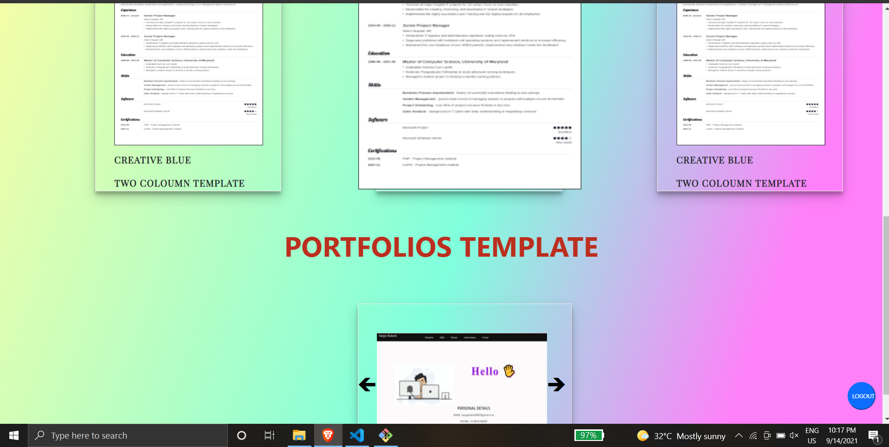

<h1>SMART CV  🧾 </h1>
<h5>A web project allow user to build creative and dynamic resumes and portfolio . Build using Tech : REACTJS , FIREBASE and for states management REDUX is used . 💻  </h5>
<h4>KEY FUNCTIONALITIES OF OF THIS PROJECT IS 👊 </h4>

Allow user to build creative and dynamic resumes and portfolio

User can share their resume and portfolio to anyone by generating public link.

User can save their resume and check in their profile section.

Resume can saved as a pdf file . 

User need to fill their details to create resume and can select any template. 

</img>

</img>

</img>

</img>

</img>

</img>